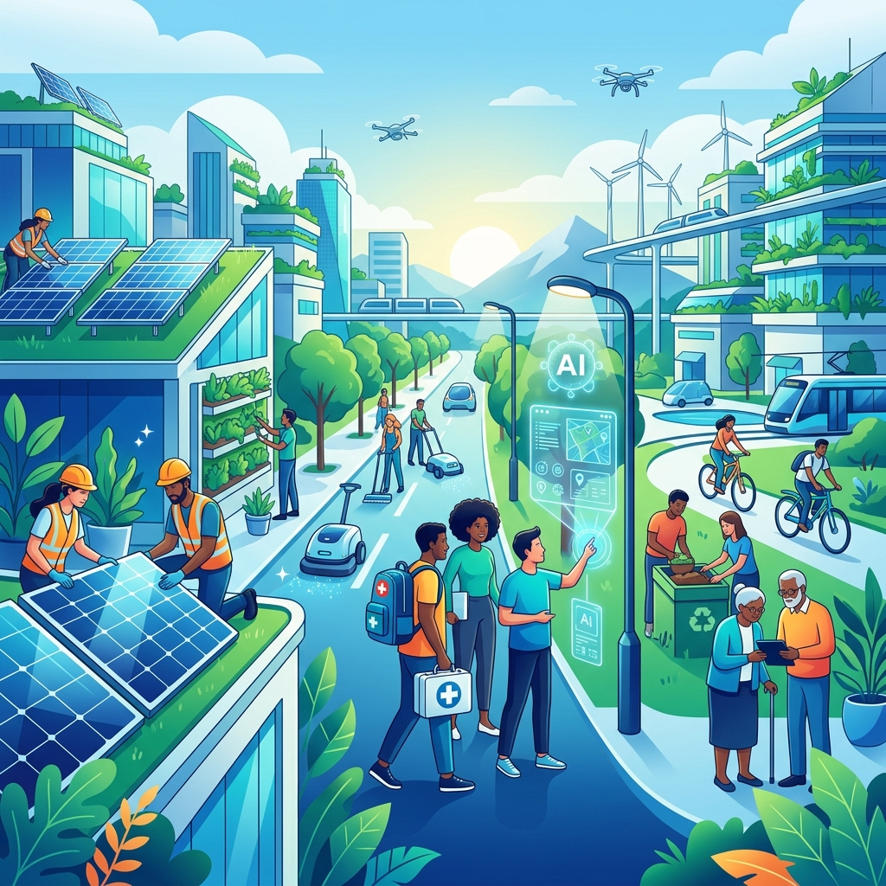
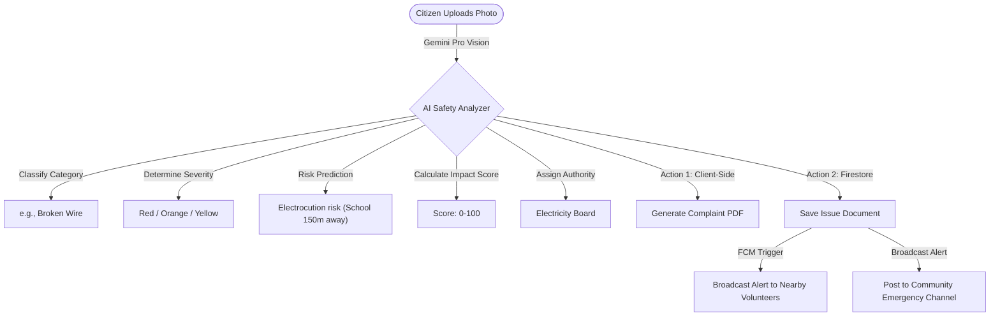
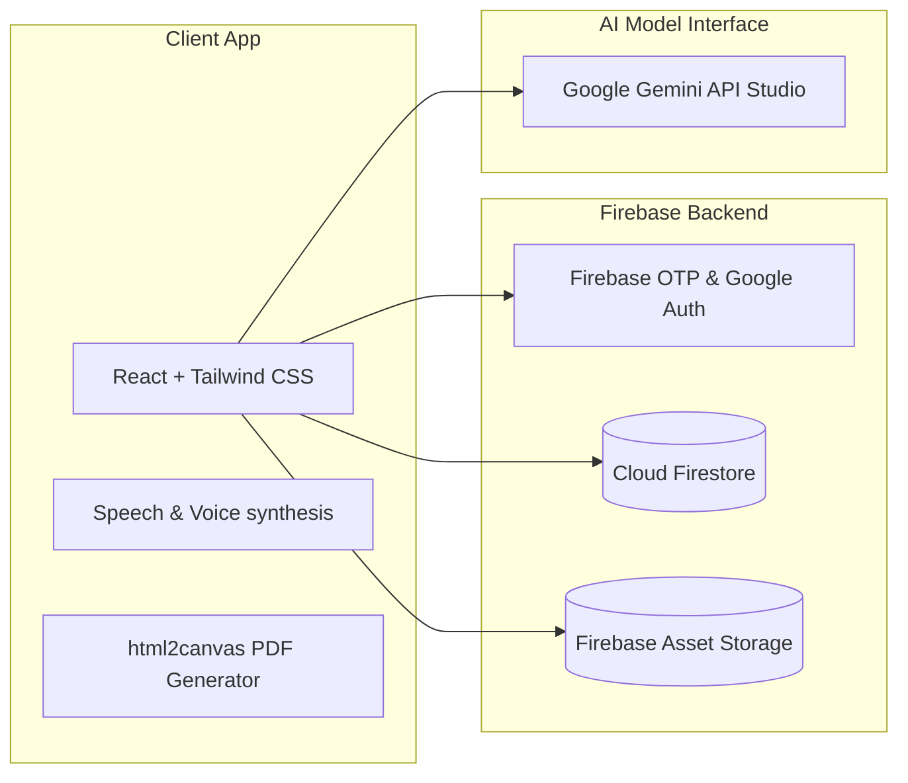

<p align="center">
  
</p>

<p align="center">
  <a href="https://github.com/Jayanti29/VANGUARD">
    
  </a>
  <a href="https://react.dev">
    
  </a>
  <a href="https://firebase.google.com">
    
  </a>
  <a href="https://ai.google.dev">
    
  </a>
</p>

<p align="center">
  <a href="https://www.typescriptlang.org">
    
  </a>
  <a href="https://tailwindcss.com">
    
  </a>
  <a href="https://vercel.com">
    
  </a>
</p>

<p align="center">
  
</p>

---

<p align="center">
  <strong>Vanguard is an AI-powered rural community protection and peer-to-peer labor marketplace designed to empower local citizens, assist nearby workers, organize safety volunteers, and streamline official civic audits.</strong>
</p>

---

## 🚀 Live Demo & Presentation

- **Production App**: [https://client-eight-sigma-10.vercel.app](https://client-eight-sigma-10.vercel.app)
- **Deployment Endpoint**: [https://client-9v1zg6a52-jayanti29s-projects.vercel.app](https://client-9v1zg6a52-jayanti29s-projects.vercel.app)
- **Demo Video**: [Watch Vanguard Presentation](https://client-eight-sigma-10.vercel.app)

---

## 📖 Table of Contents
- [Founder Story](#-founder-story)
- [The Problem Statement](#-the-problem-statement)
- [Our Solution](#-our-solution)
- [AI Engine Features](#-ai-engine-features)
- [Architecture & Workflow](#-architecture--workflow)
- [Platform Dashboards](#-platform-dashboards)
- [Tech Stack](#-tech-stack)
- [Installation Guide](#-installation-guide)
- [Deployment](#-deployment)
- [Roadmap](#-future-roadmap)
- [Social Impact](#-social-impact)
- [License](#-license)

---

## 💡 Founder Story

During a visit to a rural village in Karnataka, we witnessed a dangerous electrical wire dangling near an primary school field. Though the villagers immediately noticed the risk, there was no digital channel to record it, estimate safety severity, or report it to local ward officials. Additionally, skilled workers (plumbers, electricians) had to travel to cities for day job postings, leaving the community dry when emergencies hit.

We built **Vanguard** to close this rural-digital gap. By fusing **multimodal AI (Gemini Pro)**, real-time Firestore database synchronization, and local languages, Vanguard acts as a civic guardian and labor ecosystem in the pocket of every villager.

---

## ⚠️ The Problem Statement

Rural and semi-urban communities face significant structural challenges:
1. **Unreported Civic Hazards**: Water logging, open electrical cables, and damaged roads are left unresolved due to complex municipal red tape.
2. **Disconnected Emergency Alerts**: Localized issues (fires, floods, medical needs) require immediate community sirens to geolocate volunteers, yet local sirens do not exist.
3. **Inefficient Day Labor Markets**: Rural workers lack an online directory to declare local daily availability and negotiate daily wages with nearby residents.

---

## ✨ Our Solution

**Vanguard** is structured as a single-page digital guardian offering:
- **Multimodal AI Safety Audits**: Upload a photo of a hazard; Vanguard returns category labels, impact scores, risk analysis, and draft PDF complaint files automatically.
- **Geolocated Live Maps**: See nearby active concerns and locations.
- **Multilingual Community Channels**: Discuss concerns in English, Hindi, Kannada, Tamil, or Telugu.
- **Availability-Based Worker Registry**: Book local workers directly without intermediaries.

---

## 🤖 AI Engine Features

Vanguard integrates the **Google Gemini API** directly into two core modules:

### 1. Multimodal Civic Audit Analyzer
When a citizen uploads an image of a hazard, Vanguard triggers a Google AI Studio `generateContent` sequence, extracting:
- **Category & Severity**: Standard classifications (Red, Orange, Yellow, Green) for prioritization.
- **Civic Impact Score**: A computed gauge (0–100) reflecting hazard severity and proximity to public buildings (e.g. schools, markets).
- **Risk Prediction**: Text forecasting potential escalations (e.g. "Water ponding creates breeding grounds for Dengue vectors").
- **Government Authority Recommendation**: Mapped municipal department (e.g. Bescom, Water Board).

### 2. Conversational Assistant
An interactive voice-enabled AI companion supporting native speech input and voice synthesis (Web Speech API) to guide users on filing reports and safety procedures.

---

## 🏗️ Architecture & Workflow

### Agentic AI Pipeline


### System Architecture


---

## 🎛️ Platform Dashboards

Vanguard adapts dynamically to four roles:

| Citizen View | Worker View | Official View | Volunteer View |
| :--- | :--- | :--- | :--- |
| • Report issues using camera<br>• Chat with community channels<br>• Access i18n languages | • Toggle "Available for Work"<br>• List skills & daily rate<br>• Apply directly to job posts | • View critical statistics dashboard<br>• Mark issues as In Progress/Resolved<br>• Slide-over detail panel | • Real-time emergency siren feed<br>• Verify community hazard reports<br>• Respond as dispatcher |

---

## 🛠️ Tech Stack

<table w-full>
  <thead>
    <tr>
      <th>Layer</th>
      <th>Technologies Used</th>
    </tr>
  </thead>
  <tbody>
    <tr>
      <td><b>Frontend</b></td>
      <td>React 18, Vite, Framer Motion, React Router v6, Lucide Icons, React Leaflet (OpenStreetMap)</td>
    </tr>
    <tr>
      <td><b>Backend</b></td>
      <td>Firebase Authentication, Cloud Firestore, Firebase Storage</td>
    </tr>
    <tr>
      <td><b>AI Engine</b></td>
      <td>Google Gemini 1.5 Flash API, Web Speech API (Synthesis & Recognition)</td>
    </tr>
    <tr>
      <td><b>Styling</b></td>
      <td>Vanilla CSS variables, Tailwind CSS, Dark/Light theme providers</td>
    </tr>
  </tbody>
</table>

---

## ⚙️ Installation Guide

<details>
<summary>Click to expand setup instructions</summary>

### Prerequisites
- Node.js (v18+)
- Firebase Project setup
- Google Gemini API Key

### 1. Clone & Install
```bash
git clone https://github.com/Jayanti29/VANGUARD.git
cd VANGUARD/client
npm install
```

### 2. Configure Environment
Create `client/.env` and paste:
```env
VITE_FIREBASE_API_KEY=your_val
VITE_FIREBASE_AUTH_DOMAIN=your_val
VITE_FIREBASE_PROJECT_ID=your_val
VITE_FIREBASE_STORAGE_BUCKET=your_val
VITE_FIREBASE_MESSAGING_SENDER_ID=your_val
VITE_FIREBASE_APP_ID=your_val
VITE_GEMINI_API_KEY=your_google_ai_studio_key
```

### 3. Run Development Server
```bash
npm run dev
```
Open [http://localhost:5173](http://localhost:5173) in your browser.
</details>

---

## 🚢 Deployment

Vanguard is fully optimized for **Vercel** production deployment:

```bash
# Verify compilation build
npm run build

# Deploy client folder to production
npx vercel --prod
```

---

## 📈 Future Roadmap

- [ ] **Mobile Native Push**: Implement FCM Service Worker for native mobile notification badges.
- [ ] **Offline Firestore Sync**: Support offline issue drafting when mobile coverage is unavailable in deep rural areas.
- [ ] **Local SMS Gateway**: Integrate Twilio SMS notifications for feature-phone users who lack smartphone apps.
- [ ] **Gemini Translation Cache**: Cache common safety translations locally to reduce API roundtrip latencies.

---

## 🤝 Social Impact

Vanguard aims to directly impact rural sustainable development targets (SDGs):
- **SDG 11 (Sustainable Cities & Communities)**: Reducing civic hazards through rapid decentralized safety reporting.
- **SDG 8 (Decent Work & Economic Growth)**: Disintermediating local day labor markets, helping day workers keep 100% of their daily earnings.
- **SDG 16 (Peace, Justice & Strong Institutions)**: Establishing transparent civic complaint registries visible to municipal officers.

---

## 📄 License
This project is licensed under the **MIT License**. Feel free to use, modify, and distribute. See [LICENSE](LICENSE) for details.
