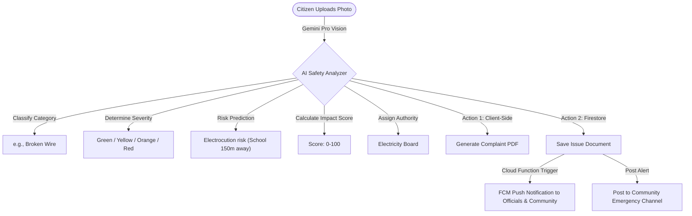

# VANGUARD — AI-Powered Community Protection & Development Platform

> "Protecting communities before problems become disasters."

## 🏆 Hackathon Submission — Vibe2Ship

**Problem Statement:** Addressing civic safety, emergency escalation, and local labor development in rural and urban India using agentic AI.

## 🚀 Live Demo
[Firebase Hosting URL Placeholder]

## 📹 Demo Video
[Link to 2-3 min screen recording Placeholder]

## ✨ Key Features
- **AI-Powered Civic Safety Analysis**: Takes photos of civic issues (potholes, garbage, water leaks) and uses Gemini Pro Vision to analyze severity, calculate impact score, predict risks, and recommend government authorities.
- **Multimodal Community Chat**: Real-time communication for general chat, emergency alerts, nearby workers, announcements, and agriculture discussions in native Indian scripts. Support for text, photos, PDFs, and voice notes.
- **Worker Marketplace**: Peer-to-peer directory matching villagers with local day-to-day workers (electricians, plumbers, farmers).
- **One-Tap Emergency Alert System**: Broadcasts high-priority notifications to nearby residents and ward officials, mapping local hospitals and police stations.
- **Live Interactive Map**: Visualizes open issues color-coded by severity, alongside official offices and emergency coordinates.
- **AI Assistant**: Conversational civic agent answering in native scripts to guide citizens through community rules and reporting.
- **Official Admin Dashboard**: An interface for ward/district officials to manage complaints, update statuses (In Progress / Resolved), and notify citizens.

## 🤖 Agentic AI Flow


## 🛠 Tech Stack
- **Frontend**: React 18, Vite, Tailwind CSS, Framer Motion, React Router v6, i18next, Google Maps JS SDK.
- **Backend**: Firebase Auth (Phone OTP + Google Sign-In), Cloud Firestore, Firebase Storage, Firebase Cloud Functions (Node.js 20), Firebase Cloud Messaging (FCM).
- **AI Engine**: Google Gemini API, Browser Web Speech API.

## 🔑 Google Technologies Used
- **Google Gemini Pro Vision / Gemini Flash** (Image & Text Analysis)
- **Firebase Authentication** (OTP + Google login)
- **Cloud Firestore & Firebase Storage** (Real-time DB + Assets)
- **Firebase Cloud Messaging** (FCM Push alerts)
- **Firebase Hosting** (Application deployment)
- **Google Maps JavaScript API** (Interactive mapping & markers)
- **Google Places & Geocoding API** (Impact calculation & Address detection)
- **Google Antigravity IDE** (Development environment)

## 📁 Project Structure
```
VANGUARD/
├── client/
│   ├── src/
│   │   ├── components/
│   │   ├── pages/
│   │   ├── lib/
│   │   ├── hooks/
│   │   ├── contexts/
│   │   └── i18n/
│   ├── package.json
│   ├── vite.config.js
│   ├── tailwind.config.js
│   └── postcss.config.js
├── functions/
│   ├── index.js
│   └── package.json
├── README.md
└── .env.example
```

## 🚀 Setup Instructions

### 1. Clone the Repository
```bash
git clone https://github.com/Jayanti29/VANGUARD.git
cd VANGUARD
```

### 2. Configure Environment Variables
Create `/client/.env` and copy variables from `/client/.env.example`. Replace placeholders with your Firebase, Google Maps, and Gemini keys.

### 3. Start the Frontend
```bash
cd client
npm install
npm run dev
```

### 4. Deploy Cloud Functions
```bash
cd ../functions
npm install
firebase deploy --only functions
```

## 🌐 Multi-Language Support
VANGUARD includes native translations and native script rendering for:
- English (EN)
- Hindi (हिन्दी)
- Kannada (ಕನ್ನಡ)
- Tamil (தமிழ்)
- Telugu (తెలుగు)
- Malayalam (മലയാളം)
- Bengali (বাংলা)
- Marathi (मराठी)
- Gujarati (ગુજરાતી)
- Punjabi (ਪੰਜਾਬੀ)
